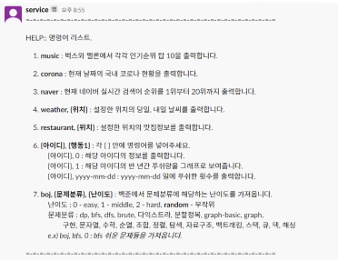
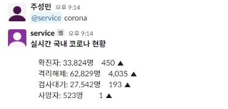
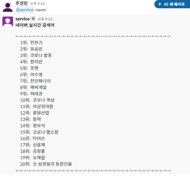
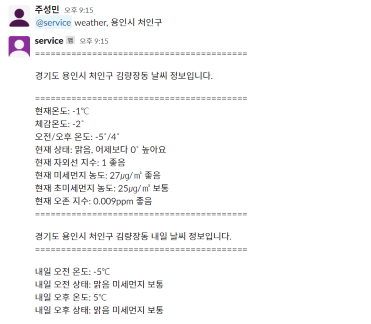
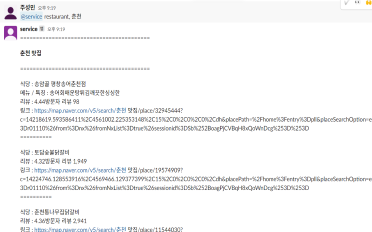

# slack_bot
# 간단한 slack chatbot을 만들어보자.

- ngrok + Slack API + Flask
```
ngrok http 8080
```
 
 먼저 ngrok 을 설치하여야 한다.
 cmd 창에서 ngrok을 설치할 수 있다.
 
 ### 실행 방법
 1. open source 를 실행한다. ( open source 실행 시 secret key의 slack token 값을 자신의 slack bot token 값으로 변경하여야 한다)
 2. cmd창에서 ngrok http 8080 을 입력한다.
 3. cmd창에 나온 forwarding의 url을 복사한다.
 4. slack api에서 설정한 bot의 event url에 붙혀넣는다.
 5. vertified가 나오면 성공
 6. slack에서 채널에 bot을 추가하여 명령어를 입력하면 된다.
 
 ### 명령어 목록

#### 1. help 유도
 

<br/>

#### 2. help


<br/>

#### 3. music


<br/>


#### 4. corona


<br/>

#### 5. naver 실시간 검색어


<br/>

#### 6. 아이디, 0


<br/>

#### 7. 아이디, 1


<br/>

#### 8. 아이디, yyyy-mm-dd


<br/>

#### 9. boj, 문제분류, level


<br/>

#### 10. boj, 문제분류, random


<br/>


#### 11. 날씨


<br/>


#### 12. 맛집


<br/>

