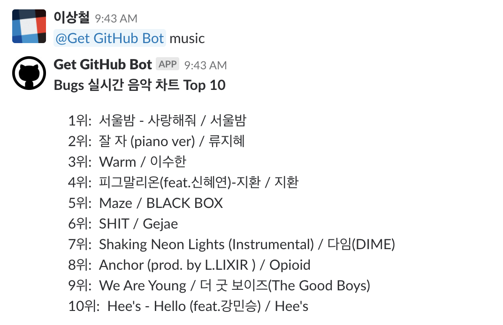
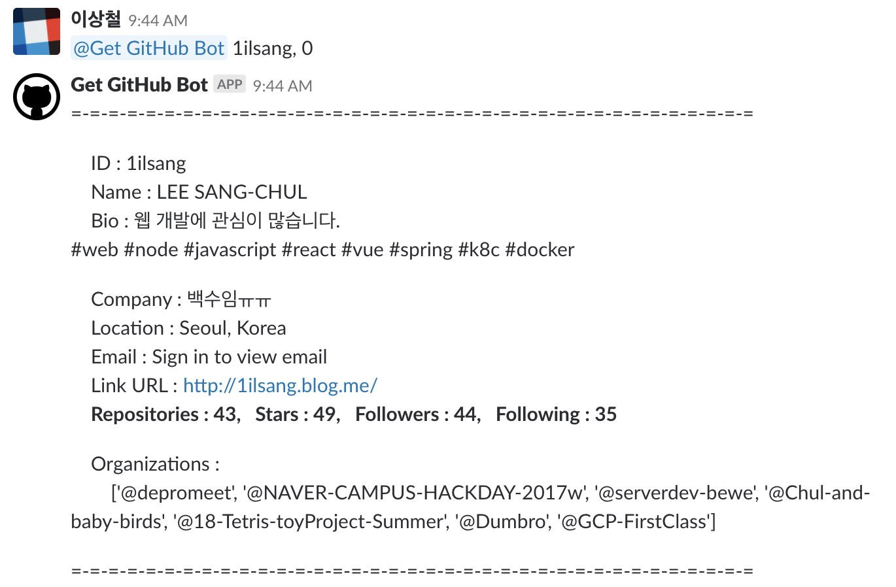
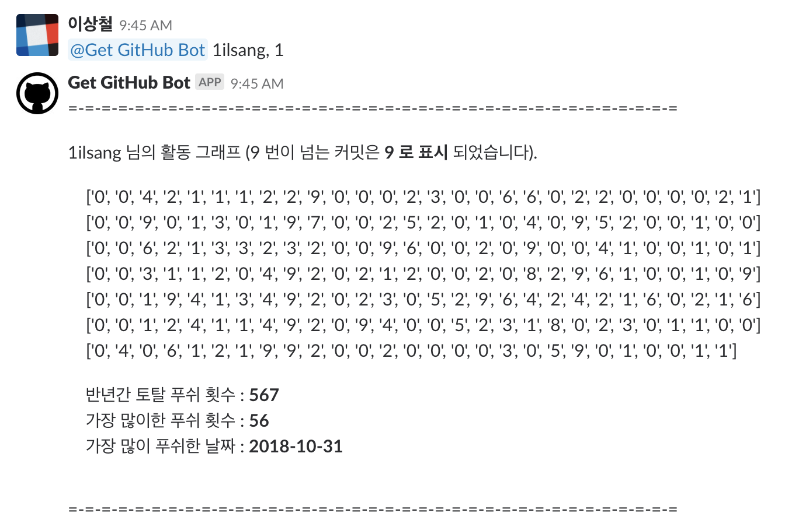
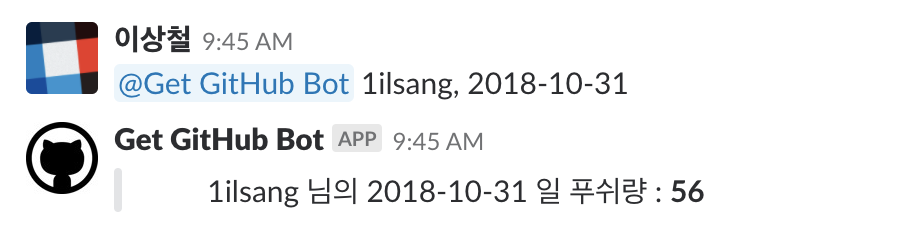
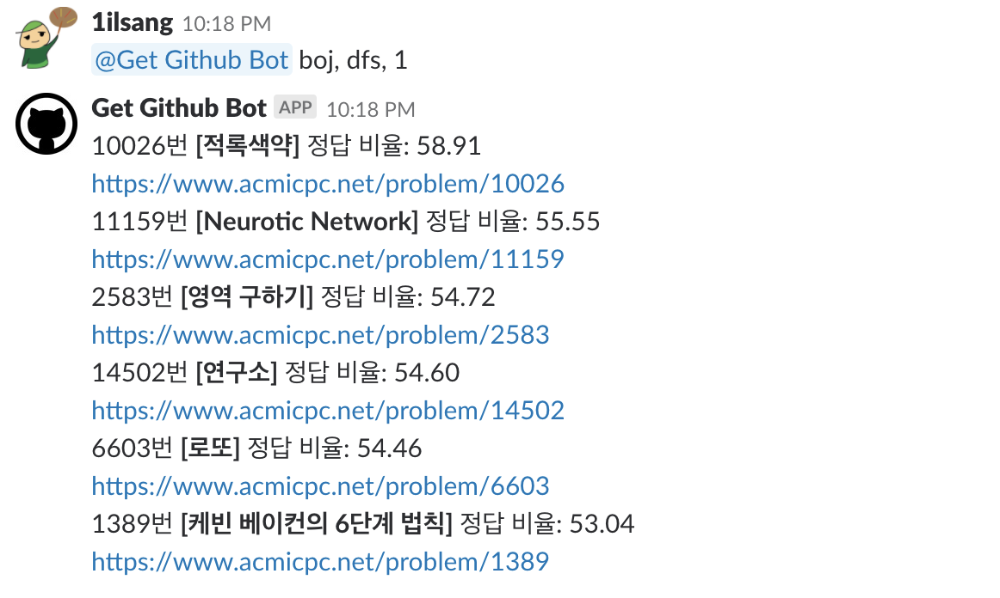
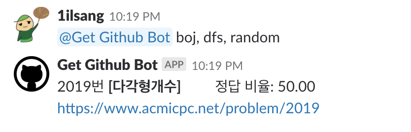

# slack_bot
# 간단한 slack chatbot을 만들어보자.

- ngrok + Slack API + Flask
```
ngrok http 8080
```
 
 ### 명령어 목록

#### 1. help 유도
 

<br/>

#### 2. help


<br/>

#### 3. music


<br/>

#### 4. 아이디, 0


<br/>

#### 5. 아이디, 1


<br/>

#### 6. 아이디, yyyy-mm-dd


<br/>

#### 7. boj, 문제분류, level


<br/>

#### 8. boj, 문제분류, random


<br/>
